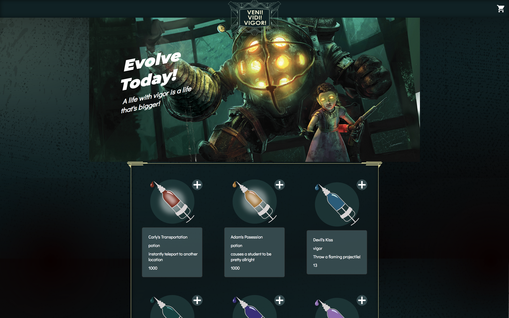
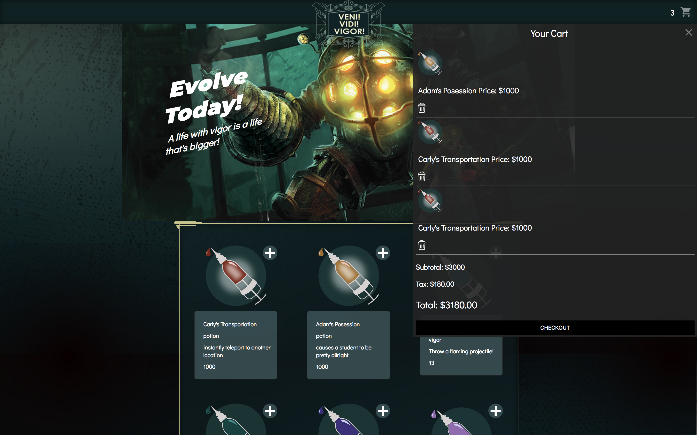
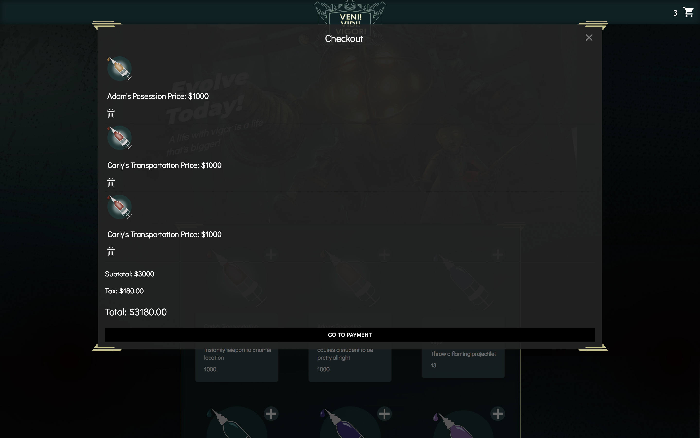
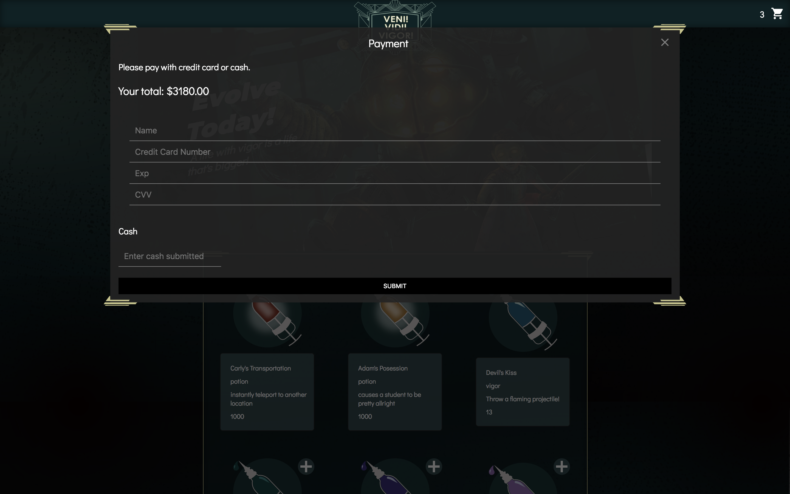
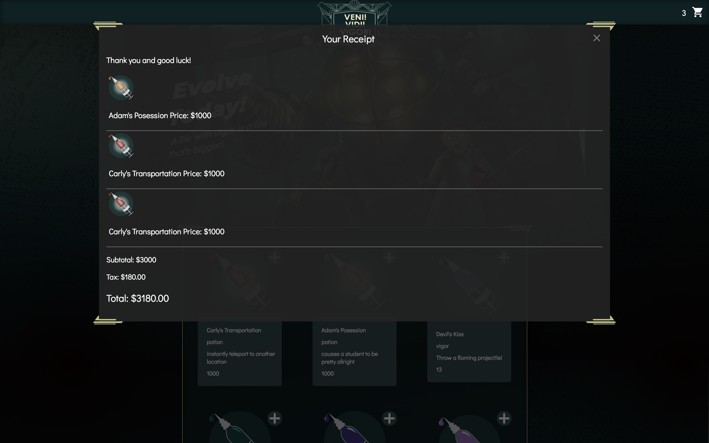

# bioshock-plasmid-shopping-cart
Group Project using HTML, CSS, JavaScript, and jQuery

Write a cash register or self-service application for some consumer-driven business.
Obvious choices include a small store, a coffee shop, or a fast food restaurant. At a
minimum, this should include:

● A list of products that have properties for name, category, description, and
price.
● Present a menu to the user and let them choose an item or items to
purchase.
○ The item(s) the user will buy will be added to a cart until they are ready
for checkout.
● Provide a way for the user to check out and view their cart.
● Give the subtotal, sales tax, and the total.
● If the user is paying in cash, ask for the amount tendered and provide
change.
● If the user is paying with a card, ask for the card number, expiration, and
CVV.
● Provide a receipt for the payment which includes the item(s) bought, the
subtotal, total, and anything else of interest.

